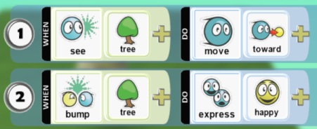

## What is Kodu?

[Kodu Game Lab](https://www.kodugamelab.com) is a 3D game development environment designed to make game programming simple and accessible to anyone.
The Kodu programming model is novel and rigorously streamlined. It dispenses with the majority of traditional programming concepts, including
symbolic variables, branching, loops, mathematical expressions, string manipulation, polymorphism, and so on. The user programs characters in the world, and 
programs are expressed in a high-level, sensory paradigm. The typical "hello world" of Kodu is:

## What is MakeKodu?

This project is an experiment - inspired by Kodu and [Microsoft TileCode](https://microsoft.github.io/tilecode/) - to see what a Kodu-like
environment would feel like in MakeCode Arcade and on supported handhelds like [Meowbit](https://www.kittenbot.cc/products/meowbit-codable-console-for-microsoft-makecode-arcade).

Try it out at [https://humanapp.github.io/makekodu/](https://humanapp.github.io/makekodu/)

### Top TODOs

- [ ] Tile art (ongoing... keep up on it).
- [x] Tile compatibility filtering (pretty good is good enough. it doesn't have to be perfect). TODO: Add conditional compatibility clauses.
- [ ] In-world terrain editor. Use tilemap as terrain & walls.
- [ ] Default world size 500x500, with glass walls.
- [ ] Make brain editor performant on Meowbit.

### TODO (General - not prioritized)

- [ ] Create MakeKodu hosting website.
- [ ] Add community features to hosting site: share world, browse shared, etc.
- [ ] Support tilemaps for terrain and wall painting.
- [ ] Support tilemap walls in physics engine.
- [x] Add "Duplicate" to character menu.
- [ ] Add rule menu: move up/down, delete.
- [x] Improve tile selection menu layout.
- [x] Implement tile compatibility filtering.
- [ ] Create character from gallery sprite.
- [ ] Actuator arbitration? Maybe.
- [x] Movement blending.
- [x] Exclusive movement support (in, but not used currently).
- [ ] Clicking "play": Delay entering play mode until A button is released. Otherwise brains can sense the button down from the click.
- [ ] When any brain has input, change "stop" button to show you have to push the "menu" button to get back to edit mode.
- [ ] Implement world boundaries. 500x500?
- [ ] Implement help for all modes.
- [ ] Implement child rules - inherit targets from parent rule.
- [ ] Networked multiplayer using pxt-socket. Matchmaking through host site.
- [ ] World settings: Background color. Behavior on glass wall collide (destroy? bounce?)
- [ ] Character settings: Friction, default speed, default health, etc.
- [ ] Brain editor: Don't show when or do insertion point if there are no valid tiles to add.
- [x] Tile compat: Only make "it" modifier available if WHEN side produces character-sensory output.
- [ ] Tile compat: Handle "constraints.handling" config property when filtering tiles.
- [x] Implement compact save format. (Sort of done -- it's still JSON, but ids are very short)
- [ ] Dynamic number of pages. Add/delete pages.
- [ ] Move brain tile left/right.
- [ ] Better brain editor perf on devices. Maybe rule tiles should be tilemap tiles and not sprites?
- [ ] In "play" mode, worldStage cursor should be in HUD layer.

### TODO (Language - not prioritized)

- [ ] "player 1-4" filters (input and sensory).
- [ ] "express" actuator. For filters and modifiers: a selection of common emojis.
- [x] "near by", "far away" filters
- [x] "bump" sensor
- [x] "wander" (as default move behavior)
- [ ] "up", "down", "left", "right" (move modifiers)
- [ ] "above", "below", "left", "right" (position relative filters)
- [ ] teams: "red", "blue", "opposite", "none"
- [x] "me", "it" filters, modifiers
- [ ] "boom" actuator
- [x] "vanish" actuator
- [ ] "shoot" actuator, "shot hit" sensor, blips
- [ ] "score" sensor, actuator. filters: team, comparisons
- [ ] "win", "lose" actuators
- [x] "timer" sensor. start with "short" and "long" stackable filters.
- [x] "camera - keep in view" actuator.
- [x] "switch page" actuator
- [ ] "call page" actuator
- [ ] "say" actuator? Maybe.
- [ ] Terrain sensor, filters. Terrain paint actuator, modifiers.
- [ ] "on terrain" move modifier. Loosely paths on matching terrain. clockwise or counter-clockwise modifiers.
- [ ] "done" final modifier to indicate brain should stop executing this frame.
- [x] Rule conditions: "when", "when not", "started to", "no longer", accessible from the rule handle.
- [ ] "next page", "prev page" tiles.
- [ ] Memory slots - remember targets.
- [ ] Play musical note with duration (long, short - stackable, but maps to musical timing scalars)

## Edit this project 

To edit this repository in MakeCode.

* open [https://arcade.makecode.com/](https://arcade.makecode.com/)
* click on **Import** then click on **Import URL**
* paste **https://github.com/humanapp/makekodu** and click import

#### Metadata (used for search, rendering)

* for PXT/arcade

